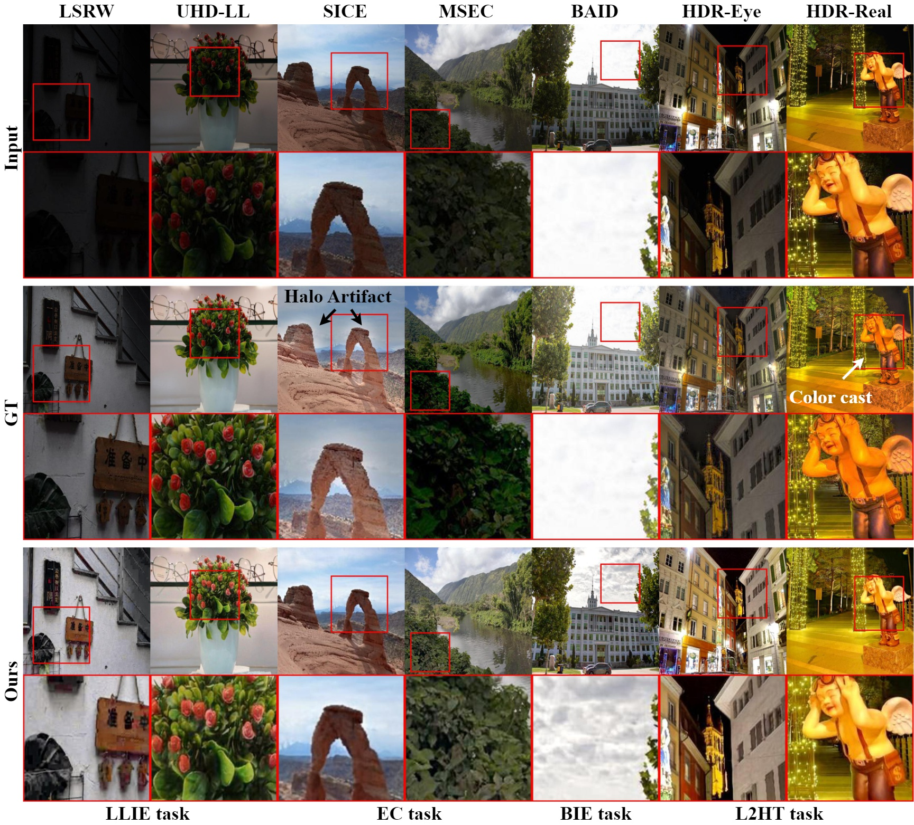
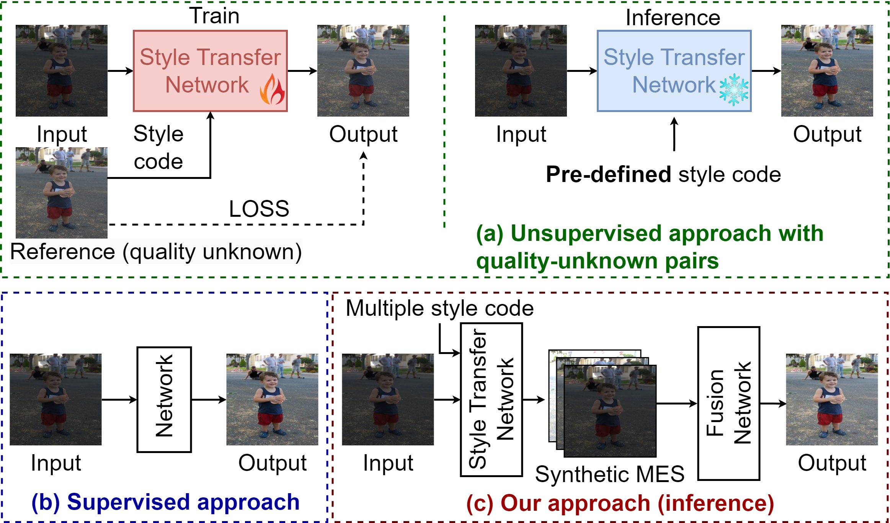

<div align="center">
<h2>UNICE: Training A Universal Image Contrast Enhancer</h2>
Ruodai Cui<sup>1</sup> |
Lei Zhang<sup>1,2</sup>

<sup>1</sup>The Hong Kong Polytechnic University, <sup>2</sup>OPPO Research Institute

</div>


<div>
<h4 align="center">
<a href="https://github.com/BeyondHeaven/UNICE" target="_blank">

</a>
&nbsp;&nbsp;&nbsp;
<a href="https://colab.research.google.com/drive/1EjIAThdFhyE_51ujdAUK0_4NRlBcKIdf?usp=sharing" target="_blank">

</a>
&nbsp;&nbsp;&nbsp;
<a href="https://huggingface.co/datasets/lahaina/UNICE" target="_blank">

</a>
&nbsp;&nbsp;&nbsp;
<a href="https://arxiv.org/abs/2507.17157" target="_blank">

</a>
</h4>
</div>

## 🌟 Overview
Our method is free of costly human labeling. However, it demonstrates
significantly stronger generalization performance than existing image contrast enhancement methods across and within different tasks,
even outperforming manually created ground-truths in multiple no-reference image quality metrics



A visual comparison with manually edited ground truth (GT) images across several datasets. The regions marked with red boxes indicate areas of local under- or over-exposure, resulting in detail loss in the GT, which may be inferior to the enhanced results produced by our UNICE model.

The core idea of this method is to use a multi-exposure fusion sequence as supervision signals, generate a sequence from a single 8-bit image, and then perform multi-exposure fusion.



## 🚀 Training

Our UNICE Dataset is available at [huggingface](https://huggingface.co/datasets/lahaina/UNICE).

This repository contains the **exposure control** branch.
For the **fusion** functionality, please switch to the `fusion` branch.

To set up the environment, use the provided `environment.yaml` file:

```bash
conda env create -f environment.yaml
```

To train the model, run the following command:

```bash
CUDA_VISIBLE_DEVICES=1 ../miniconda3/envs/img2img-turbo/bin/python src/train_pix2pix_turbo.py \
  --pretrained_model_name_or_path="stabilityai/sd-turbo" \
  --output_dir="output/pix2pix_turbo/exposure" \
  --dataset_folder="data/exposure" \
  --resolution=512 \
  --train_batch_size=2 \
  --enable_xformers_memory_efficient_attention \
  --viz_freq 50 \
  --report_to "wandb" \
  --tracker_project_name "pix2pix_turbo_exposure"
```

> GPU Memory requirements:
> On a Tesla A100 40GB GPU:
> - Batch size 1 requires ~19561MiB
> - Batch size 2 requires ~34853MiB

## 🧪 Testing

You can also check [Colab](https://colab.research.google.com/drive/1EjIAThdFhyE_51ujdAUK0_4NRlBcKIdf?usp=sharing) for a convenient test.

🔗 **Pre-trained weights** are available at [huggingface.](https://huggingface.co/lahaina/unice/tree/main/checkpoints)

To test the model with different exposure values, use the following script:

```bash
#!/bin/bash

# Define the exposure value
exposure=0.5
output_dir="output/$exposure"

CUDA_VISIBLE_DEVICES=5 ../miniconda3/envs/img2img-turbo/bin/python src/inference.py \
--model_path "checkpoints/exposure.pkl" \
--input_dir /local/mnt/workspace/ruodcui/code/adaptive_3dlut/data/BAID512/input/ \
--output_dir $output_dir \
--prompt "exposure control" \
--exposure $exposure

```

## 🙏 Acknowledgements

This project borrows code from img2img-turbo. We sincerely thank the authors for their contributions to the community.

If you have any questions, please feel free to contact me at cuiruodai@qq.com.

If our code helps your research or work, please consider citing our paper.
The following are BibTeX references:

```
@misc{ruodai2025UNICE,
      title={UNICE: Training A Universal Image Contrast Enhancer},
      author={Ruodai Cui and Lei Zhang},
      year={2025},
      eprint={2507.17157},
      archivePrefix={arXiv},
      primaryClass={cs.CV},
      url={https://arxiv.org/abs/2507.17157},
}
```